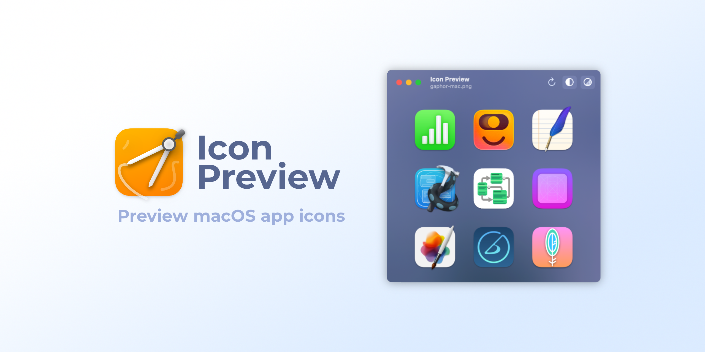

  
  <h1 align="center">Icon Preview</h1>

A native macOS app for previewing app icons for macOS. You can preview icons in many different file formats, but I suggest using the SVG file format with a design tool that enables editing the SVG file directly (e.g. [Inkscape](https://inkscape.org)) in order to get live updates. The window will always stay on top.

There is a similar app for GNOME called [App Icon Preview](https://tools.design.gnome.org).

## Table of Contents

- [Installation](#Installation)
- [Usage](#Usage)
- [Thanks](#Thanks)

## Installation

1. Download Icon Preview [here](https://github.com/david-swift/IconPreview/releases/latest/download/Icon.Preview.app.zip).
2. Move `Icon Preview.app` from the `Downloads` into the `Applications` folder.
3. Press and hold the `Ctrl` key while you click on `Icon Preview.app` in the `Applications` folder. Do not launch it from the Launchpad or by double-clicking.
4. Click on `Open`.
5. In the panel that appears now, click on `Open`.

## Usage

Click on `Open File` (or `File > Import Image`) to load an image file into the app. You can now change the file on the disk and the preview will automatically update.
Use the three buttons in the toolbar (or the corresponding keyboard shortcuts, take a look at the `View` menu in the menu bar) to change the appearance.

You can use the [Template](Template.svg) as a starting point in [Inkscape](https://inkscape.org).

## Thanks

- The [App Icon Preview app](https://gitlab.gnome.org/World/design/app-icon-preview) for GNOME that served as an inspiration
- [This comment](https://stackoverflow.com/a/74496754/22579339) on StackOverflow
- [SwiftLint](https://github.com/realm/SwiftLint) for checking whether code style conventions are violated
- The programming language [Swift](https://github.com/apple/swift)
